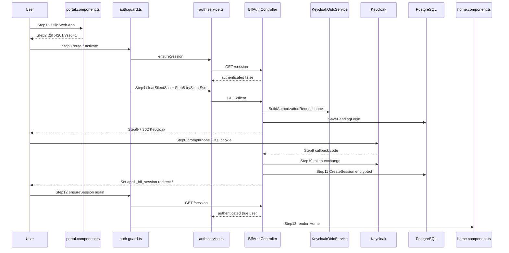
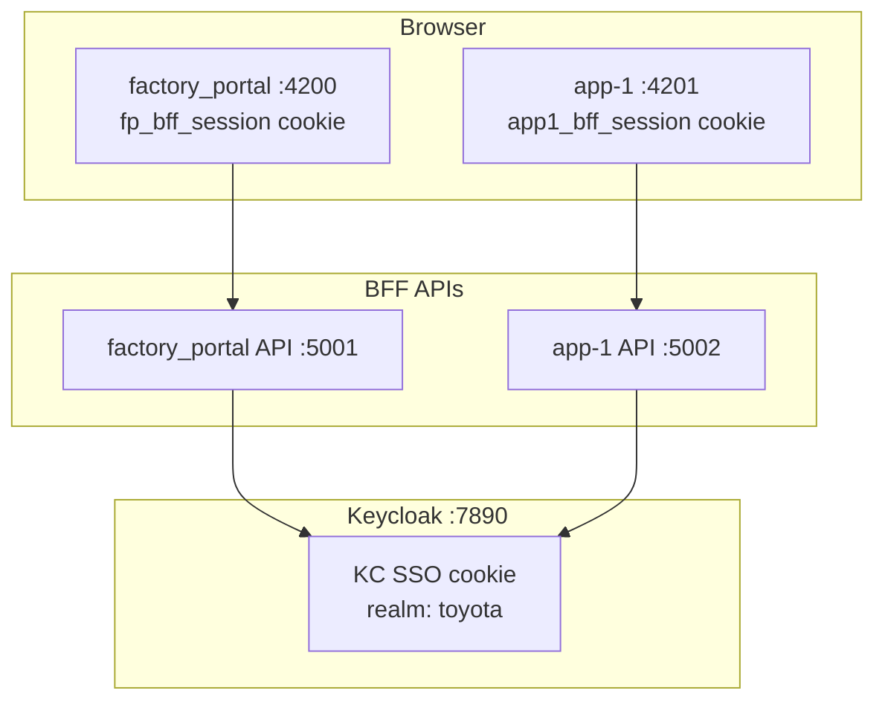
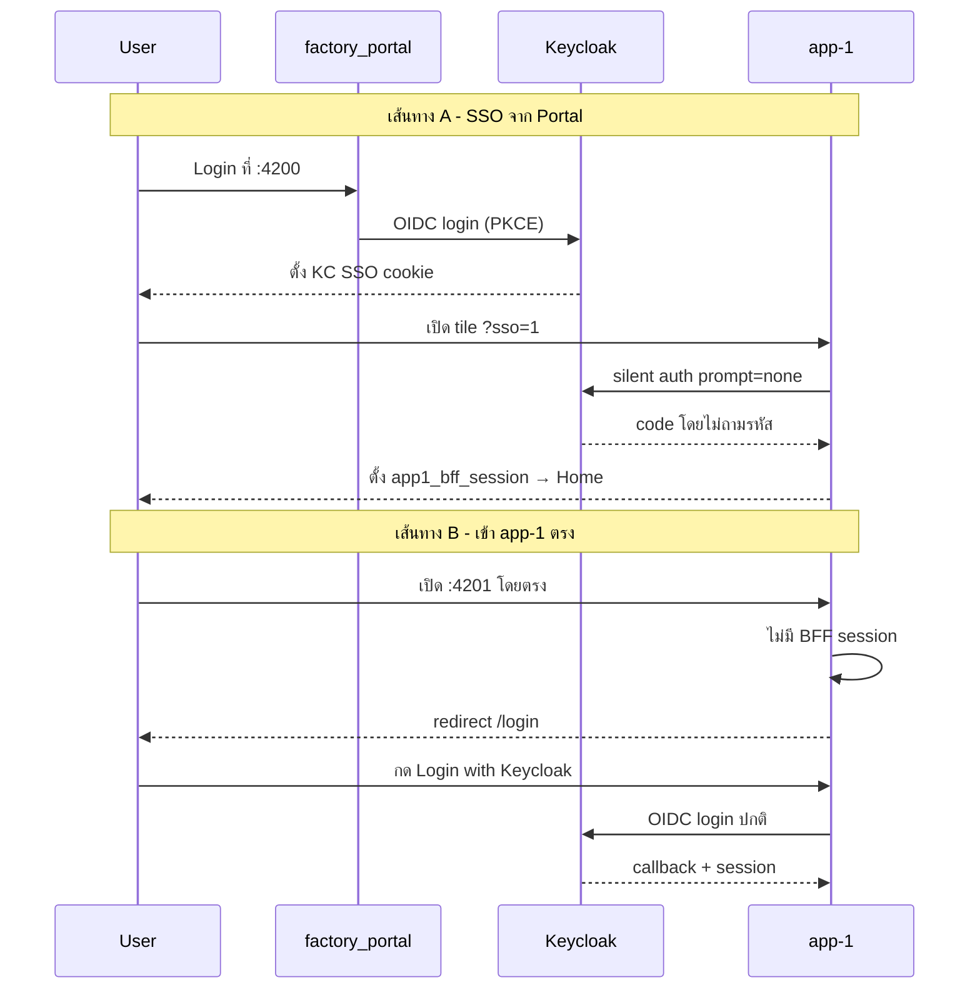

# แผนสอน Keycloak Auth ของ app-1 สำหรับโปรแกรมเมอร์มือใหม่

## เป้าหมายการเรียนรู้

เมื่อจบหลักสูตร ผู้เรียนต้องทำได้ 3 อย่างนี้:

1. **อธิบายได้** ว่าทำไม login จาก factory_portal แล้วเปิด app-1 ไม่ต้องกรอกรหัสซ้ำ
2. **แก้ไขแอปเก่า** ให้ใช้ pattern เดียวกับ app-1 (แทน JWT/sessionStorage แบบเดิม เช่นใน [basic_app](d:\Portal Web Demo\basic_app))
3. **สร้างแอปใหม่** โดย copy โครงสร้าง BFF จาก app-1 และตั้งค่า Keycloak client ให้ถูกต้อง

---

## หัวใจหลักสูตร: Step-by-Step จากกด Tile → เข้า Home (เทียบ Code)

ใช้ส่วนนี้เป็นสคริปต์สอนหลัก — ทุก Step มีรูปแบบเดียวกัน: **Input → Process (โค้ดไหน) → Output (ได้อะไร)**

### สถานะก่อนเริ่ม (Prerequisite — Step 0)

ผู้ใช้ต้อง login factory_portal แล้ว เพื่อให้ Keycloak มี SSO session ใน browser

| | รายละเอียด |
|---|------------|
| **Input** | User กรอก `demo`/`demo` ที่ `http://localhost:4200/login` |
| **Process** | factory_portal BFF flow เหมือน app-1 แต่ client = `factory-portal`, cookie = `fp_bff_session` |
| **Output** | Cookie `fp_bff_session` ที่ `:4200` + **Keycloak SSO cookie** ที่ `:7890` (realm `toyota`) |
| **โค้ดอ้างอิง** | [factory_portal/backend/Controllers/BffAuthController.cs](d:\Portal Web Demo\factory_portal\backend\Controllers\BffAuthController.cs) — `Login` → `Callback` |

> **จุดสอนสำคัญ:** `fp_bff_session` ไม่ถูกส่งไป app-1 — สิ่งที่แชร์คือ **KC SSO cookie** ที่ Keycloak เท่านั้น

---

### Step 1 — กด Tile "Web App" ที่ Portal

| มิติ | รายละเอียด |
|------|------------|
| **User เห็น** | คลิก tile "Web App" บนหน้า portal |
| **Input** | `appName === 'Web App'` จาก template click |
| **Process** | `openApp()` เรียก `window.open(...)` |
| **Output** | เปิด tab ใหม่ไปที่ `http://localhost:4201/?sso=1` |
| **โค้ด** | [factory_portal/frontend/src/app/portal/portal.component.ts](d:\Portal Web Demo\factory_portal\frontend\src\app\portal\portal.component.ts) บรรทัด 45–48 |

```typescript
if (appName === 'Web App') {
  window.open('http://localhost:4201/?sso=1', '_blank', 'noopener,noreferrer');
}
```

**ได้อะไร:** URL พร้อม query `sso=1` — สัญญาณบอก app-1 ว่า "มาจาก portal ให้ลอง silent SSO ก่อน"

---

### Step 2 — Browser โหลด app-1 Angular

| มิติ | รายละเอียด |
|------|------------|
| **Input** | `GET http://localhost:4201/?sso=1` |
| **Process** | Angular bootstrap → Router จับ path `''` (home) |
| **Output** | Route `''` ถูก activate พร้อม `canActivate: [authGuard]` |
| **โค้ด** | [app-1/frontend/src/app/app.routes.ts](d:\Portal Web Demo\app-1\frontend\src\app\app.routes.ts) |

```typescript
{ path: '', canActivate: [authGuard], component: HomeComponent }
```

**ได้อะไร:** ยังไม่เห็น Home — guard ทำงานก่อน component

---

### Step 3 — authGuard ตรวจ Session ครั้งแรก

| มิติ | รายละเอียด |
|------|------------|
| **Input** | ยังไม่มี cookie `app1_bff_session` (ครั้งแรกที่เปิด app-1) |
| **Process** | `authService.ensureSession()` → `fetch('/api/bff/auth/session', { credentials: 'include' })` |
| **Output** | API ตอบ `{ authenticated: false }` → guard ดำเนินการต่อ |
| **โค้ด** | [auth.guard.ts](d:\Portal Web Demo\app-1\frontend\src\app\auth\auth.guard.ts) บรรทัด 9–11, [auth.service.ts](d:\Portal Web Demo\app-1\frontend\src\app\auth\auth.service.ts) บรรทัด 41–64 |

```typescript
// auth.guard.ts
if (await authService.ensureSession()) {
  return true;  // ← ยังไม่เข้า branch นี้
}
```

**ได้อะไร:** ยืนยันว่า app-1 ยังไม่มี BFF session ของตัวเอง → ต้องทำ SSO ต่อ

---

### Step 4 — authGuard เห็น `?sso=1` แล้ว reset flag

| มิติ | รายละเอียด |
|------|------------|
| **Input** | `route.queryParamMap.get('sso') === '1'` |
| **Process** | `authService.clearSilentSsoAttempted()` — รีเซ็ต flag ใน memory |
| **Output** | `silentSsoAttempted = false` พร้อมลอง silent SSO ใหม่ |
| **โค้ด** | [auth.guard.ts](d:\Portal Web Demo\app-1\frontend\src\app\auth\auth.guard.ts) บรรทัด 13–15 |

**ได้อะไร:** แม้เคยลอง silent SSO มาก่อนใน tab เดิม พอมาจาก portal (`?sso=1`) จะลองใหม่ได้

---

### Step 5 — authGuard สั่ง Silent SSO

| มิติ | รายละเอียด |
|------|------------|
| **Input** | `hasAttemptedSilentSso() === false` |
| **Process** | `trySilentSsoLogin()` → ตั้ง flag → `window.location.assign('/api/bff/auth/silent')` |
| **Output** | Browser ออกจาก Angular ไป full-page redirect ที่ BFF |
| **โค้ด** | [auth.guard.ts](d:\Portal Web Demo\app-1\frontend\src\app\auth\auth.guard.ts) 17–19, [auth.service.ts](d:\Portal Web Demo\app-1\frontend\src\app\auth\auth.service.ts) 67–74 |

```typescript
this.silentSsoAttempted = true;
window.location.assign('/api/bff/auth/silent');
return false;  // guard บล็อก navigation ชั่วคราว
```

**ได้อะไร:** Request ไป backend — nginx/proxy ส่งต่อ `localhost:5002`

---

### Step 6 — BFF รับ Silent SSO Request

| มิติ | รายละเอียด |
|------|------------|
| **Input** | `GET /api/bff/auth/silent` |
| **Process** | ตรวจ `EnableSilentSso === true` → สร้าง OIDC request พร้อม `prompt=none` |
| **Output** | Cookie `app1_bff_pending` + HTTP 302 ไป Keycloak |
| **โค้ด** | [BffAuthController.cs](d:\Portal Web Demo\app-1\backend\Controllers\BffAuthController.cs) `Silent()` บรรทัด 44–56 |

```csharp
var (authUrl, pending) = _oidcService.BuildAuthorizationRequest("none");
var pendingId = _sessionStore.SavePendingLogin(pending);  // → PostgreSQL
_cookieService.SetPendingLoginCookie(Response, pendingId);   // → app1_bff_pending
return Redirect(authUrl);
```

**ได้อะไร:**
- DB แถว `bff_pending_logins`: `state`, `code_verifier`, `prompt=none`
- Cookie `app1_bff_pending` = pending ID (HttpOnly, 10 นาที)

---

### Step 7 — สร้าง URL ไป Keycloak (PKCE)

| มิติ | รายละเอียด |
|------|------------|
| **Input** | `prompt = "none"` |
| **Process** | สุ่ม `state` + `code_verifier` → คำนวณ `code_challenge` (S256) → ประกอบ query string |
| **Output** | URL เช่น `http://localhost:7890/realms/toyota/protocol/openid-connect/auth?client_id=app-1&redirect_uri=.../callback&response_type=code&scope=openid+profile+email&state=...&code_challenge=...&code_challenge_method=S256&prompt=none` |
| **โค้ด** | [KeycloakOidcService.cs](d:\Portal Web Demo\app-1\backend\Services\KeycloakOidcService.cs) `BuildAuthorizationRequest()` บรรทัด 30–60 |

**ได้อะไร:** Authorization request ที่บอก Keycloak "ถ้ามี SSO session อยู่แล้ว อย่าถามรหัส ส่ง code กลับเลย"

---

### Step 8 — Keycloak ตรวจ SSO Cookie

| มิติ | รายละเอียด |
|------|------------|
| **Input** | Auth request + **KC SSO cookie** จาก Step 0 (login portal) |
| **Process** | Keycloak เห็น session ใน realm `toyota` ยัง valid → ไม่แสดงหน้า login |
| **Output** | HTTP 302 กลับ `redirect_uri` พร้อม `?code=...&state=...` |
| **โค้ด** | ฝั่ง Keycloak (ไม่มีใน repo) — อธิบายด้วย DevTools Network |

**ได้อะไร:** Authorization code (ใช้ครั้งเดียว, อายุสั้น) — **ยังไม่ใช่ access token**

---

### Step 9 — BFF Callback รับ Code

| มิติ | รายละเอียด |
|------|------------|
| **Input** | `GET /api/bff/auth/callback?code=...&state=...` + cookie `app1_bff_pending` |
| **Process** | อ่าน pending จาก DB → เปรียบเทียบ `state` → ลบ pending cookie |
| **Output** | ผ่าน validation → ไป token exchange; ถ้า `error=login_required` → redirect `/login?sso=failed` |
| **โค้ด** | [BffAuthController.cs](d:\Portal Web Demo\app-1\backend\Controllers\BffAuthController.cs) `Callback()` บรรทัด 58–84 |

```csharp
var pending = _sessionStore.GetPendingLogin(pendingId);
if (!string.Equals(state, pending.State, StringComparison.Ordinal))
    → redirect /login?error=invalid_callback
```

**ได้อะไร:** ยืนยันว่า callback มาจาก flow ที่เราเริ่ม (ป้องกัน CSRF)

---

### Step 10 — Token Exchange (Server-side)

| มิติ | รายละเอียด |
|------|------------|
| **Input** | `code` + `code_verifier` จาก pending login |
| **Process** | `POST` ไป Keycloak token endpoint (`grant_type=authorization_code`, PKCE) |
| **Output** | `TokenResponse`: `access_token`, `refresh_token`, `id_token`, `expires_in` |
| **โค้ด** | [KeycloakOidcService.cs](d:\Portal Web Demo\app-1\backend\Services\KeycloakOidcService.cs) `ExchangeCodeAsync()` บรรทัด 63–75 |

**ได้อะไร:** Token จริง — อยู่ฝั่ง server เท่านั้น ยังไม่ส่งไป Angular

---

### Step 11 — Validate Token + สร้าง BFF Session

| มิติ | รายละเอียด |
|------|------------|
| **Input** | `access_token` จาก Keycloak |
| **Process** | `BffTokenValidator` ตรวจ signature, issuer, audience, expiry → สร้าง session ใน DB (encrypt tokens) |
| **Output** | Cookie `app1_bff_session` = session ID + HTTP 302 ไป `http://localhost:4201/` |
| **โค้ด** | [BffAuthController.cs](d:\Portal Web Demo\app-1\backend\Controllers\BffAuthController.cs) บรรทัด 92–101, [BffCookieService.cs](d:\Portal Web Demo\app-1\backend\Services\BffCookieService.cs) |

```csharp
var session = _sessionStore.CreateSession(tokens, user);  // tokens เข้ารหัสใน PostgreSQL
_cookieService.SetSessionCookie(Response, session.SessionId);
return Redirect("http://localhost:4201/");
```

**ได้อะไร:**
- Cookie `app1_bff_session` (HttpOnly, SameSite=Lax, 30 นาที idle)
- DB `bff_sessions`: encrypted access/refresh/id token + user claims
- Browser กลับหน้า Home ของ app-1

---

### Step 12 — authGuard ตรวจ Session ครั้งที่สอง (สำเร็จ)

| มิติ | รายละเอียด |
|------|------------|
| **Input** | Cookie `app1_bff_session` ถูกส่งมากับ request |
| **Process** | `ensureSession()` → `GET /api/bff/auth/session` → BFF อ่าน session จาก DB → validate/refresh token |
| **Output** | `{ authenticated: true, user: { subject, username, email, name } }` → guard `return true` |
| **โค้ด** | [auth.guard.ts](d:\Portal Web Demo\app-1\frontend\src\app\auth\auth.guard.ts) 9–11, [BffAuthController.cs](d:\Portal Web Demo\app-1\backend\Controllers\BffAuthController.cs) `Session()` บรรทัด 104–151 |

```typescript
this.authenticated.set(true);
this.currentUser.set(data.user);
return true;  // guard ปล่อยเข้า Home
```

**ได้อะไร:** Angular signals ใน memory รู้ว่า login แล้ว + ข้อมูล user สำหรับแสดง UI

---

### Step 13 — HomeComponent แสดงผล

| มิติ | รายละเอียด |
|------|------------|
| **Input** | Guard ผ่านแล้ว |
| **Process** | `ngOnInit()` → `ensureSession()` อีกครั้ง → `getUserDisplayName()` |
| **Output** | หน้า "You are already logged in via Keycloak SSO" + ชื่อ user |
| **โค้ด** | [home.component.ts](d:\Portal Web Demo\app-1\frontend\src\app\home.component.ts) บรรทัด 26–28 |

**ได้อะไร:** User เห็น home โดยไม่เคยกดปุ่ม "Login with Keycloak"

---

### สรุปภาพรวมทุก Step (แผนที่สอน)



### ตารางสรุป Input / Process / Output ทุก Step

| Step | Trigger | Input | Process (ไฟล์หลัก) | Output |
|------|---------|-------|-------------------|--------|
| 0 | Login portal | username/password | factory_portal BFF | `fp_bff_session` + KC SSO cookie |
| 1 | กด tile | `appName` | `portal.component.ts` | Tab ใหม่ `?sso=1` |
| 2 | โหลด URL | `GET /?sso=1` | `app.routes.ts` | activate `authGuard` |
| 3 | Guard รอบ 1 | ไม่มี `app1_bff_session` | `auth.guard` + `auth.service` | `authenticated: false` |
| 4 | เห็น `sso=1` | query param | `auth.guard` | reset silent flag |
| 5 | ลอง SSO | flag=false | `auth.service` | redirect `/silent` |
| 6 | BFF silent | GET /silent | `BffAuthController` | `app1_bff_pending` + 302 KC |
| 7 | สร้าง auth URL | prompt=none | `KeycloakOidcService` | PKCE auth URL |
| 8 | Keycloak | KC SSO cookie | Keycloak server | `code` + `state` |
| 9 | Callback | code, state, pending | `BffAuthController.Callback` | validated หรือ error |
| 10 | Exchange | code + verifier | `KeycloakOidcService` | access/refresh/id token |
| 11 | สร้าง session | tokens | `BffSessionStore` + `BffCookieService` | `app1_bff_session` + redirect `/` |
| 12 | Guard รอบ 2 | session cookie | `auth.guard` + `Session()` | `authenticated: true` |
| 13 | แสดง Home | user claims | `home.component.ts` | UI ชื่อ user |

---

### เส้นทาง B — เข้า app-1 ตรง (เทียบ Step เดิม)

ใช้ตาราง diff สอนว่า step ไหนเปลี่ยนเมื่อไม่มี KC SSO session:

| Step | จาก Portal (SSO) | เข้าตรง `:4201` |
|------|------------------|-----------------|
| 1 | กด tile → `?sso=1` | พิมพ์ URL ตรง ไม่มี `sso` |
| 4 | reset silent flag | ข้าม (ไม่มี `sso=1`) |
| 5 | redirect `/silent` | guard redirect `/login` |
| 8 | KC ส่ง code ทันที | KC แสดงหน้า login (หรือ `/login?sso=failed` ถ้า silent ล้มเหลว) |
| 5B | — | User กดปุ่ม → `redirectToLogin()` → `/api/bff/auth/login` (ไม่มี `prompt=none`) |
| 7B | `prompt=none` | ไม่มี prompt → Keycloak ถามรหัส |

**โค้ดเส้นทาง B เพิ่มเติม:**
- [login.component.ts](d:\Portal Web Demo\app-1\frontend\src\app\auth\login.component.ts) — แสดงปุ่ม "Login with Keycloak"
- `BffAuthController.Login()` — เหมือน `Silent()` แต่ไม่ส่ง `prompt=none`

---

## แนวคิดที่ต้องสอนก่อนลงมือ (30–45 นาที)

### 1. Mental Model — 3 ชั้นที่ต้องแยกให้ออก



| ชั้น | เก็บอะไร | แชร์ข้ามแอปไหม |
|------|----------|----------------|
| **BFF cookie** (`app1_bff_session`) | Session ID ของแอปนั้น | ไม่ — แยกตาม origin (`4200` vs `4201`) |
| **Keycloak SSO cookie** | Session ที่ IdP | ใช่ — ทุกแอปใน realm `toyota` |
| **Token จริง** (access/refresh) | PostgreSQL ฝั่ง server (เข้ารหัส AES) | ไม่ — ไม่เคยอยู่ใน JavaScript |

คำถามใน [factory_portal/NOTE_KEYCLOAK.txt](d:\Portal Web Demo\factory_portal\NOTE_KEYCLOAK.txt) ควรใช้เป็นจุดเริ่มอภิปราย: *"kc_* token อยู่ที่ไหน?"* → **คำตอบ: ไม่อยู่ใน browser เลย**

### 2. BFF Pattern — ทำไมไม่ใช้ keycloak-js ใน Angular

- Frontend **ไม่เก็บ token** — เรียก `fetch('/api/bff/auth/session', { credentials: 'include' })` เท่านั้น
- Backend ทำ PKCE, token exchange, validate JWT, refresh, encrypt เก็บ DB
- Browser ได้แค่ **HttpOnly cookie** → ปลอดภัยกว่า `sessionStorage`

### 3. สองเส้นทาง Login ที่ต้องเข้าใจ



---

## โครงสร้างหลักสูตร (แนะนำ 2 วัน หรือ 4 ครั้ง x 3 ชม.)

### วันที่ 1 — อ่านโค้ด + trace flow

**Lab 1: รัน stack และทดสอบด้วยมือ** (อ้างอิง [SECURITY_VERIFICATION.md](d:\Portal Web Demo\SECURITY_VERIFICATION.md))

```powershell
# Terminal 1
cd factory_portal && docker compose up -d

# Terminal 2
cd app-1 && docker compose up -d
```

| ขั้นตอน | URL | ผลที่คาดหวัง |
|---------|-----|--------------|
| Login portal | `http://localhost:4200/login` | เข้า portal ได้ |
| เปิด tile Web App | `http://localhost:4201/?sso=1` | เข้า home โดยไม่กด login |
| เปิด incognito ตรง | `http://localhost:4201` | เห็นหน้า login + ปุ่ม Keycloak |
| Logout app-1 | ปุ่ม logout | กลับ login, portal ยัง login อยู่ |

**Lab 2: Trace โค้ดตาม Step 1–13** — ใช้ตาราง [Step-by-Step จากกด Tile](#หัวใจหลักสูตร-step-by-step-จากกด-tile--เข้า-home-เทียบ-code) เปิดไฟล์ทีละ Step พร้อม DevTools Network

**Lab 2 (เดิม): ไฟล์อ้างอิงเพิ่มเติม**

**Frontend (Angular) — จุดที่มือใหม่แตะบ่อยสุด**

| ลำดับ | ไฟล์ | สิ่งที่ต้องเข้าใจ |
|-------|------|------------------|
| 1 | [app-1/frontend/src/app/auth/auth.service.ts](d:\Portal Web Demo\app-1\frontend\src\app\auth\auth.service.ts) | `ensureSession()`, `trySilentSsoLogin()`, `redirectToLogin()` |
| 2 | [app-1/frontend/src/app/auth/auth.guard.ts](d:\Portal Web Demo\app-1\frontend\src\app\auth\auth.guard.ts) | ลำดับ: check session → `?sso=1` → silent SSO → `/login` |
| 3 | [app-1/frontend/src/app/auth/login.component.ts](d:\Portal Web Demo\app-1\frontend\src\app\auth\login.component.ts) | หน้า login ตรง + จัดการ `?sso=failed` |
| 4 | [app-1/frontend/src/app/app.routes.ts](d:\Portal Web Demo\app-1\frontend\src\app\app.routes.ts) | route ไหน public / protected |
| 5 | [factory_portal/frontend/src/app/portal/portal.component.ts](d:\Portal Web Demo\factory_portal\frontend\src\app\portal\portal.component.ts) | tile เปิด `?sso=1` |

**Backend (.NET) — อ่านครั้งเดียวเข้าใจทั้ง flow**

| ลำดับ | ไฟล์ | สิ่งที่ต้องเข้าใจ |
|-------|------|------------------|
| 1 | [app-1/backend/Controllers/BffAuthController.cs](d:\Portal Web Demo\app-1\backend\Controllers\BffAuthController.cs) | endpoints: `login`, `silent`, `callback`, `session`, `logout` |
| 2 | [app-1/backend/Services/KeycloakOidcService.cs](d:\Portal Web Demo\app-1\backend\Services\KeycloakOidcService.cs) | PKCE, `redirect_uri`, `prompt=none` |
| 3 | [app-1/backend/Services/BffTokenValidator.cs](d:\Portal Web Demo\app-1\backend\Services\BffTokenValidator.cs) | fail-closed: token ไม่ valid = ไม่สร้าง session |
| 4 | [app-1/backend/Authentication/BffAuthenticationHandler.cs](d:\Portal Web Demo\app-1\backend\Authentication\BffAuthenticationHandler.cs) | ทุก API request อ่าน cookie → validate → refresh |
| 5 | [app-1/backend/appsettings.json](d:\Portal Web Demo\app-1\backend\appsettings.json) | `Keycloak`, `Bff.EnableSilentSso: true` |

**Lab 3: ใช้ DevTools ดู network**

- ดู request `/api/bff/auth/session` — มี cookie `app1_bff_session` หรือไม่
- ดู redirect chain ของ `/api/bff/auth/silent` — ไป Keycloak แล้วกลับ callback
- ยืนยันว่า **ไม่มี** access token ใน Response body ของ frontend

---

### วันที่ 2 — นำไปใช้กับแอปใหม่ / แอปเก่า

#### กรณี A: สร้างแอปใหม่ (copy จาก app-1)

**Checklist สิ่งที่ต้องเปลี่ยนต่อแอป**

| รายการ | app-1 ตัวอย่าง | แอปใหม่ |
|--------|----------------|---------|
| Keycloak Client ID | `app-1` | `my-new-app` |
| Frontend port | `4201` | เช่น `4202` |
| API port | `5002` | เช่น `5003` |
| BFF cookie name | `app1_bff_session` | `myapp_bff_session` |
| Callback URI | `http://localhost:4201/api/bff/auth/callback` | ตาม port ใหม่ |
| `Bff.PublicBaseUrl` | `http://localhost:4201` | ตาม port ใหม่ |
| `EnableSilentSso` | `true` | `true` (ถ้ารับ SSO จาก portal) |
| Postgres DB | แยกต่อแอป | แยกต่อแอป |

**Keycloak Admin (port 7890)** — สร้าง client ใหม่:

- Client type: **Public**
- Standard flow: ON
- Valid redirect URIs: `http://localhost:<port>/api/bff/auth/callback`
- Valid post logout redirect: `http://localhost:<port>/login`
- PKCE: S256 (app-1 ใช้อยู่แล้ว ไม่ต้องมี client secret)

**factory_portal** — เพิ่ม tile ใน [portal.component.ts](d:\Portal Web Demo\factory_portal\frontend\src\app\portal\portal.component.ts):

```typescript
window.open('http://localhost:4202/?sso=1', '_blank', 'noopener,noreferrer');
```

**ไฟล์ที่ copy จาก app-1 ไปแอปใหม่ (ขั้นต่ำ)**

Backend:
- `Controllers/BffAuthController.cs`
- `Services/KeycloakOidcService.cs`, `BffSessionStore.cs`, `BffCookieService.cs`, `BffTokenValidator.cs`, `TokenCipherService.cs`
- `Authentication/BffAuthenticationHandler.cs`
- `Configuration/Settings.cs` (ส่วน Keycloak + Bff)
- ส่วน DI ใน `Program.cs` ที่เกี่ยวกับ auth

Frontend:
- โฟลเดอร์ `src/app/auth/` ทั้งหมด
- `proxy.conf.json` / `nginx.conf` — proxy `/api` ไป backend
- `app.routes.ts` — เพิ่ม `authGuard`

#### กรณี B: แก้แอปเก่า (เช่น basic_app ที่ใช้ JWT ใน cookie แบบ custom)

[basic_app](d:\Portal Web Demo\basic_app) ใช้ [AuthController.cs](d:\Portal Web Demo\basic_app\backend\Controllers\AuthController.cs) แบบ username/password + JWT เอง — **ไม่ compatible กับ Keycloak SSO**

ขั้นตอน migration แนะนำ:

1. **อย่า** พยายาม bridge token ระหว่างระบบเก่ากับ Keycloak — ใช้ BFF แทนทั้งก้อน
2. ลบ/ปิด custom login UI ที่รับ username/password (หรือเก็บไว้เฉพาะ dev)
3. Copy BFF layer จาก app-1 เข้า backend
4. แทนที่ Angular auth service เก่าด้วย [auth.service.ts](d:\Portal Web Demo\app-1\frontend\src\app\auth\auth.service.ts) pattern
5. เปลี่ยน API calls ให้ใช้ `credentials: 'include'` แทนการแนบ Bearer token จาก memory/storage
6. อัปเดต E2E tests ใน [basic_app/frontend/e2e/tests/auth.spec.ts](d:\Portal Web Demo\basic_app\frontend\e2e\tests\auth.spec.ts) ให้ flow ผ่าน Keycloak/BFF

---

## สิ่งที่ควรสร้างใน repo (Training Artifacts)

แนะนำเพิ่มเอกสารใน repo (ยังไม่มี README ใน app-1):

| ไฟล์ที่แนะนำสร้าง | เนื้อหา |
|-------------------|---------|
| `app-1/docs/AUTH_GUIDE.md` | คู่มือภาษาไทย — **Step 1–13 (Input/Process/Output)** + mental model + config reference |
| `app-1/docs/AUTH_LAB.md` | แบบฝึกหัด 5 ข้อ + เฉลย (trace flow, ทดสอบ SSO, debug `sso=failed`) |
| `app-1/docs/NEW_APP_CHECKLIST.md` | checklist copy BFF + Keycloak client setup |
| `factory_portal/keycloak/realm-toyota.json` | **restore ไฟล์ที่หาย** — อ้างอิงใน SECURITY_VERIFICATION แต่ไม่มีใน repo ทำให้มือใหม่ตั้ง Keycloak ไม่ได้ |

### แบบฝึกหัดที่วัดผลได้ (Assessment)

1. **อธิบายปากเปล่า** 3 cookies/sessions ที่เกี่ยวข้องเมื่อ user login ผ่าน portal แล้วเปิด app-1
2. **Debug** กรณี `?sso=failed` — หาสาเหตุที่เป็นไปได้ 3 ข้อ (ไม่มี KC session, redirect URI ผิด, `EnableSilentSso=false`)
3. **Hands-on** เพิ่ม route `/profile` ที่ต้อง login และเรียก `/api/me` ด้วย cookie
4. **Hands-on** ตั้ง client Keycloak ใหม่สำหรับ port 4202 และเพิ่ม tile ใน portal

---

## กฎสำคัญที่มือใหม่มักพลาด (ใส่ใน FAQ)

| ผิด | ถูก |
|-----|-----|
| เก็บ access token ใน `sessionStorage` | เก็บเฉพาะใน BFF DB (encrypted) |
| ใช้ cookie เดียวกับ factory_portal | แต่ละแอปมี BFF cookie ของตัวเอง |
| คาดหวัง silent SSO โดยไม่ login Keycloak ก่อน | ต้องมี KC SSO session จาก portal หรือ login app-1 เอง |
| ตั้ง `redirect_uri` เป็น `/login` | ต้องเป็น `/api/bff/auth/callback` |
| เปิด `EnableSilentSso` ใน factory_portal | portal เป็น **login hub** — เปิดเฉพาะ consumer apps (app-1) |
| ลืม `credentials: 'include'` ใน fetch | cookie ไม่ถูกส่ง → session เสมอ false |

---

## ลำดับการสอนแบบย่อ (Quick Reference สำหรับ Senior ที่สอน)

1. **Step 0–13 walkthrough** — กด tile แล้วไล่ Input/Process/Output ทีละ step (สคริปต์หลัก)
2. Demo เส้นทาง B (เข้าตรง `:4201`) เทียบ diff กับตารางเส้นทาง B
3. อธิบาย 3-layer model (BFF cookie / KC SSO / server tokens)
4. Lab: DevTools network trace คู่ Step 5–11
5. Lab: เพิ่ม protected route `/profile`
6. Lab: checklist สร้างแอปใหม่ / migrate basic_app
7. ทดสอบตาม [SECURITY_VERIFICATION.md](d:\Portal Web Demo\SECURITY_VERIFICATION.md)

---

## ความเสี่ยง / งานที่ควรทำก่อนสอน

- **Keycloak realm import หาย** — ควร commit `realm-toyota.json` และ mount ใน [factory_portal/docker-compose.yml](d:\Portal Web Demo\factory_portal\docker-compose.yml) เพื่อให้ client `app-1` และ `factory-portal` ถูกสร้างอัตโนมัติ
- **ไม่มี README ใน app-1** — มือใหม่จะหลงทาง; ควรมี `AUTH_GUIDE.md` เป็นจุดเริ่ม
- **basic_app ใช้ auth คนละแบบ** — ต้องชี้ชัดว่าเป็น "before" ตัวอย่าง migration ไม่ใช่ reference implementation
