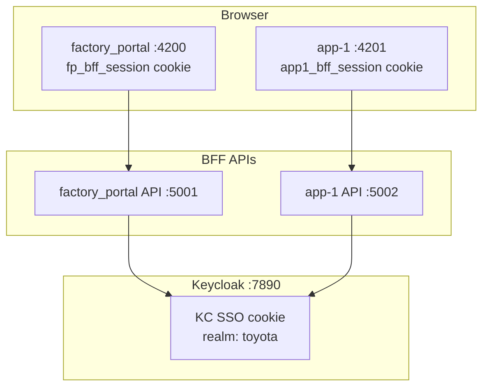
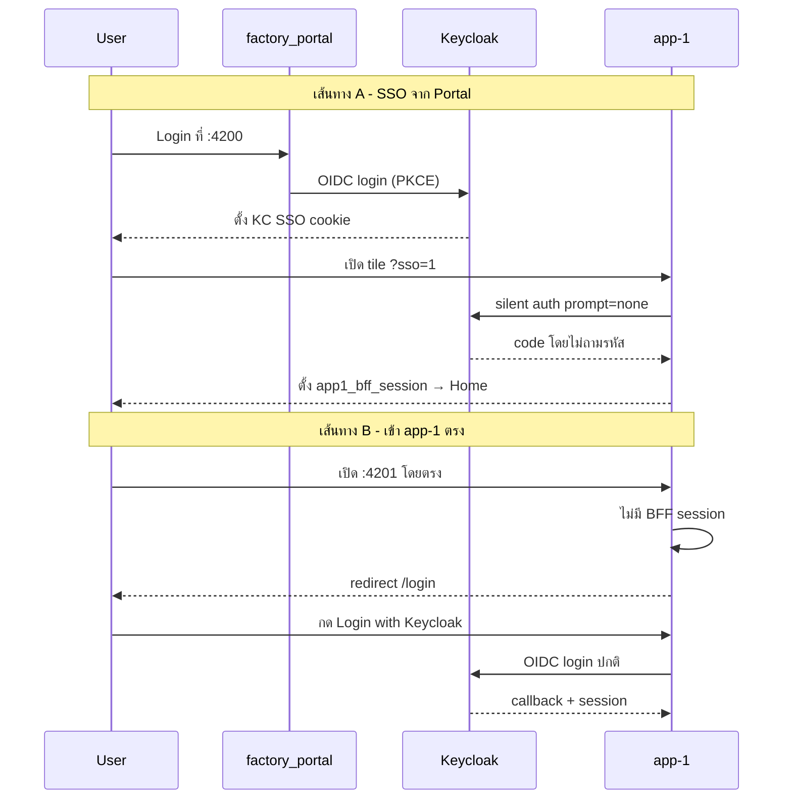

# แผนสอน Keycloak Auth ของ app-1 สำหรับโปรแกรมเมอร์มือใหม่

## เป้าหมายการเรียนรู้

เมื่อจบหลักสูตร ผู้เรียนต้องทำได้ 3 อย่างนี้:

1. **อธิบายได้** ว่าทำไม login จาก factory_portal แล้วเปิด app-1 ไม่ต้องกรอกรหัสซ้ำ
2. **แก้ไขแอปเก่า** ให้ใช้ pattern เดียวกับ app-1 (แทน JWT/sessionStorage แบบเดิม เช่นใน [basic_app](d:\Portal Web Demo\basic_app))
3. **สร้างแอปใหม่** โดย copy โครงสร้าง BFF จาก app-1 และตั้งค่า Keycloak client ให้ถูกต้อง

---

## แนวคิดที่ต้องสอนก่อนลงมือ (30–45 นาที)

### 1. Mental Model — 3 ชั้นที่ต้องแยกให้ออก



| ชั้น | เก็บอะไร | แชร์ข้ามแอปไหม |
|------|----------|----------------|
| **BFF cookie** (`app1_bff_session`) | Session ID ของแอปนั้น | ไม่ — แยกตาม origin (`4200` vs `4201`) |
| **Keycloak SSO cookie** | Session ที่ IdP | ใช่ — ทุกแอปใน realm `toyota` |
| **Token จริง** (access/refresh) | PostgreSQL ฝั่ง server (เข้ารหัส AES) | ไม่ — ไม่เคยอยู่ใน JavaScript |

คำถามใน [factory_portal/NOTE_KEYCLOAK.txt](d:\Portal Web Demo\factory_portal\NOTE_KEYCLOAK.txt) ควรใช้เป็นจุดเริ่มอภิปราย: *"kc_* token อยู่ที่ไหน?"* → **คำตอบ: ไม่อยู่ใน browser เลย**

### 2. BFF Pattern — ทำไมไม่ใช้ keycloak-js ใน Angular

- Frontend **ไม่เก็บ token** — เรียก `fetch('/api/bff/auth/session', { credentials: 'include' })` เท่านั้น
- Backend ทำ PKCE, token exchange, validate JWT, refresh, encrypt เก็บ DB
- Browser ได้แค่ **HttpOnly cookie** → ปลอดภัยกว่า `sessionStorage`

### 3. สองเส้นทาง Login ที่ต้องเข้าใจ



---

## โครงสร้างหลักสูตร (แนะนำ 2 วัน หรือ 4 ครั้ง x 3 ชม.)

### วันที่ 1 — อ่านโค้ด + trace flow

**Lab 1: รัน stack และทดสอบด้วยมือ** (อ้างอิง [SECURITY_VERIFICATION.md](d:\Portal Web Demo\SECURITY_VERIFICATION.md))

```powershell
# Terminal 1
cd factory_portal && docker compose up -d

# Terminal 2
cd app-1 && docker compose up -d
```

| ขั้นตอน | URL | ผลที่คาดหวัง |
|---------|-----|--------------|
| Login portal | `http://localhost:4200/login` | เข้า portal ได้ |
| เปิด tile Web App | `http://localhost:4201/?sso=1` | เข้า home โดยไม่กด login |
| เปิด incognito ตรง | `http://localhost:4201` | เห็นหน้า login + ปุ่ม Keycloak |
| Logout app-1 | ปุ่ม logout | กลับ login, portal ยัง login อยู่ |

**Lab 2: Trace โค้ดตามลำดับ** — ให้ผู้เรียนเปิดไฟล์ตาม flow นี้:

**Frontend (Angular) — จุดที่มือใหม่แตะบ่อยสุด**

| ลำดับ | ไฟล์ | สิ่งที่ต้องเข้าใจ |
|-------|------|------------------|
| 1 | [app-1/frontend/src/app/auth/auth.service.ts](d:\Portal Web Demo\app-1\frontend\src\app\auth\auth.service.ts) | `ensureSession()`, `trySilentSsoLogin()`, `redirectToLogin()` |
| 2 | [app-1/frontend/src/app/auth/auth.guard.ts](d:\Portal Web Demo\app-1\frontend\src\app\auth\auth.guard.ts) | ลำดับ: check session → `?sso=1` → silent SSO → `/login` |
| 3 | [app-1/frontend/src/app/auth/login.component.ts](d:\Portal Web Demo\app-1\frontend\src\app\auth\login.component.ts) | หน้า login ตรง + จัดการ `?sso=failed` |
| 4 | [app-1/frontend/src/app/app.routes.ts](d:\Portal Web Demo\app-1\frontend\src\app\app.routes.ts) | route ไหน public / protected |
| 5 | [factory_portal/frontend/src/app/portal/portal.component.ts](d:\Portal Web Demo\factory_portal\frontend\src\app\portal\portal.component.ts) | tile เปิด `?sso=1` |

**Backend (.NET) — อ่านครั้งเดียวเข้าใจทั้ง flow**

| ลำดับ | ไฟล์ | สิ่งที่ต้องเข้าใจ |
|-------|------|------------------|
| 1 | [app-1/backend/Controllers/BffAuthController.cs](d:\Portal Web Demo\app-1\backend\Controllers\BffAuthController.cs) | endpoints: `login`, `silent`, `callback`, `session`, `logout` |
| 2 | [app-1/backend/Services/KeycloakOidcService.cs](d:\Portal Web Demo\app-1\backend\Services\KeycloakOidcService.cs) | PKCE, `redirect_uri`, `prompt=none` |
| 3 | [app-1/backend/Services/BffTokenValidator.cs](d:\Portal Web Demo\app-1\backend\Services\BffTokenValidator.cs) | fail-closed: token ไม่ valid = ไม่สร้าง session |
| 4 | [app-1/backend/Authentication/BffAuthenticationHandler.cs](d:\Portal Web Demo\app-1\backend\Authentication\BffAuthenticationHandler.cs) | ทุก API request อ่าน cookie → validate → refresh |
| 5 | [app-1/backend/appsettings.json](d:\Portal Web Demo\app-1\backend\appsettings.json) | `Keycloak`, `Bff.EnableSilentSso: true` |

**Lab 3: ใช้ DevTools ดู network**

- ดู request `/api/bff/auth/session` — มี cookie `app1_bff_session` หรือไม่
- ดู redirect chain ของ `/api/bff/auth/silent` — ไป Keycloak แล้วกลับ callback
- ยืนยันว่า **ไม่มี** access token ใน Response body ของ frontend

---

### วันที่ 2 — นำไปใช้กับแอปใหม่ / แอปเก่า

#### กรณี A: สร้างแอปใหม่ (copy จาก app-1)

**Checklist สิ่งที่ต้องเปลี่ยนต่อแอป**

| รายการ | app-1 ตัวอย่าง | แอปใหม่ |
|--------|----------------|---------|
| Keycloak Client ID | `app-1` | `my-new-app` |
| Frontend port | `4201` | เช่น `4202` |
| API port | `5002` | เช่น `5003` |
| BFF cookie name | `app1_bff_session` | `myapp_bff_session` |
| Callback URI | `http://localhost:4201/api/bff/auth/callback` | ตาม port ใหม่ |
| `Bff.PublicBaseUrl` | `http://localhost:4201` | ตาม port ใหม่ |
| `EnableSilentSso` | `true` | `true` (ถ้ารับ SSO จาก portal) |
| Postgres DB | แยกต่อแอป | แยกต่อแอป |

**Keycloak Admin (port 7890)** — สร้าง client ใหม่:

- Client type: **Public**
- Standard flow: ON
- Valid redirect URIs: `http://localhost:<port>/api/bff/auth/callback`
- Valid post logout redirect: `http://localhost:<port>/login`
- PKCE: S256 (app-1 ใช้อยู่แล้ว ไม่ต้องมี client secret)

**factory_portal** — เพิ่ม tile ใน [portal.component.ts](d:\Portal Web Demo\factory_portal\frontend\src\app\portal\portal.component.ts):

```typescript
window.open('http://localhost:4202/?sso=1', '_blank', 'noopener,noreferrer');
```

**ไฟล์ที่ copy จาก app-1 ไปแอปใหม่ (ขั้นต่ำ)**

Backend:
- `Controllers/BffAuthController.cs`
- `Services/KeycloakOidcService.cs`, `BffSessionStore.cs`, `BffCookieService.cs`, `BffTokenValidator.cs`, `TokenCipherService.cs`
- `Authentication/BffAuthenticationHandler.cs`
- `Configuration/Settings.cs` (ส่วน Keycloak + Bff)
- ส่วน DI ใน `Program.cs` ที่เกี่ยวกับ auth

Frontend:
- โฟลเดอร์ `src/app/auth/` ทั้งหมด
- `proxy.conf.json` / `nginx.conf` — proxy `/api` ไป backend
- `app.routes.ts` — เพิ่ม `authGuard`

#### กรณี B: แก้แอปเก่า (เช่น basic_app ที่ใช้ JWT ใน cookie แบบ custom)

[basic_app](d:\Portal Web Demo\basic_app) ใช้ [AuthController.cs](d:\Portal Web Demo\basic_app\backend\Controllers\AuthController.cs) แบบ username/password + JWT เอง — **ไม่ compatible กับ Keycloak SSO**

ขั้นตอน migration แนะนำ:

1. **อย่า** พยายาม bridge token ระหว่างระบบเก่ากับ Keycloak — ใช้ BFF แทนทั้งก้อน
2. ลบ/ปิด custom login UI ที่รับ username/password (หรือเก็บไว้เฉพาะ dev)
3. Copy BFF layer จาก app-1 เข้า backend
4. แทนที่ Angular auth service เก่าด้วย [auth.service.ts](d:\Portal Web Demo\app-1\frontend\src\app\auth\auth.service.ts) pattern
5. เปลี่ยน API calls ให้ใช้ `credentials: 'include'` แทนการแนบ Bearer token จาก memory/storage
6. อัปเดต E2E tests ใน [basic_app/frontend/e2e/tests/auth.spec.ts](d:\Portal Web Demo\basic_app\frontend\e2e\tests\auth.spec.ts) ให้ flow ผ่าน Keycloak/BFF

---

## สิ่งที่ควรสร้างใน repo (Training Artifacts)

แนะนำเพิ่มเอกสารใน repo (ยังไม่มี README ใน app-1):

| ไฟล์ที่แนะนำสร้าง | เนื้อหา |
|-------------------|---------|
| `app-1/docs/AUTH_GUIDE.md` | คู่มือภาษาไทย — mental model, flow diagram, config reference |
| `app-1/docs/AUTH_LAB.md` | แบบฝึกหัด 5 ข้อ + เฉลย (trace flow, ทดสอบ SSO, debug `sso=failed`) |
| `app-1/docs/NEW_APP_CHECKLIST.md` | checklist copy BFF + Keycloak client setup |
| `factory_portal/keycloak/realm-toyota.json` | **restore ไฟล์ที่หาย** — อ้างอิงใน SECURITY_VERIFICATION แต่ไม่มีใน repo ทำให้มือใหม่ตั้ง Keycloak ไม่ได้ |

### แบบฝึกหัดที่วัดผลได้ (Assessment)

1. **อธิบายปากเปล่า** 3 cookies/sessions ที่เกี่ยวข้องเมื่อ user login ผ่าน portal แล้วเปิด app-1
2. **Debug** กรณี `?sso=failed` — หาสาเหตุที่เป็นไปได้ 3 ข้อ (ไม่มี KC session, redirect URI ผิด, `EnableSilentSso=false`)
3. **Hands-on** เพิ่ม route `/profile` ที่ต้อง login และเรียก `/api/me` ด้วย cookie
4. **Hands-on** ตั้ง client Keycloak ใหม่สำหรับ port 4202 และเพิ่ม tile ใน portal

---

## กฎสำคัญที่มือใหม่มักพลาด (ใส่ใน FAQ)

| ผิด | ถูก |
|-----|-----|
| เก็บ access token ใน `sessionStorage` | เก็บเฉพาะใน BFF DB (encrypted) |
| ใช้ cookie เดียวกับ factory_portal | แต่ละแอปมี BFF cookie ของตัวเอง |
| คาดหวัง silent SSO โดยไม่ login Keycloak ก่อน | ต้องมี KC SSO session จาก portal หรือ login app-1 เอง |
| ตั้ง `redirect_uri` เป็น `/login` | ต้องเป็น `/api/bff/auth/callback` |
| เปิด `EnableSilentSso` ใน factory_portal | portal เป็น **login hub** — เปิดเฉพาะ consumer apps (app-1) |
| ลืม `credentials: 'include'` ใน fetch | cookie ไม่ถูกส่ง → session เสมอ false |

---

## ลำดับการสอนแบบย่อ (Quick Reference สำหรับ Senior ที่สอน)

1. Demo SSO ทั้ง 2 เส้นทาง (portal tile vs direct)
2. อธิบาย 3-layer model (BFF cookie / KC SSO / server tokens)
3. Walkthrough frontend 4 ไฟล์ (`auth.service` → `guard` → `login` → `routes`)
4. Walkthrough backend `BffAuthController` + `callback`
5. Lab: DevTools network trace
6. Lab: เพิ่ม protected route
7. Lab: checklist สร้างแอปใหม่ / migrate basic_app
8. ทดสอบตาม [SECURITY_VERIFICATION.md](d:\Portal Web Demo\SECURITY_VERIFICATION.md)

---

## ความเสี่ยง / งานที่ควรทำก่อนสอน

- **Keycloak realm import หาย** — ควร commit `realm-toyota.json` และ mount ใน [factory_portal/docker-compose.yml](d:\Portal Web Demo\factory_portal\docker-compose.yml) เพื่อให้ client `app-1` และ `factory-portal` ถูกสร้างอัตโนมัติ
- **ไม่มี README ใน app-1** — มือใหม่จะหลงทาง; ควรมี `AUTH_GUIDE.md` เป็นจุดเริ่ม
- **basic_app ใช้ auth คนละแบบ** — ต้องชี้ชัดว่าเป็น "before" ตัวอย่าง migration ไม่ใช่ reference implementation
